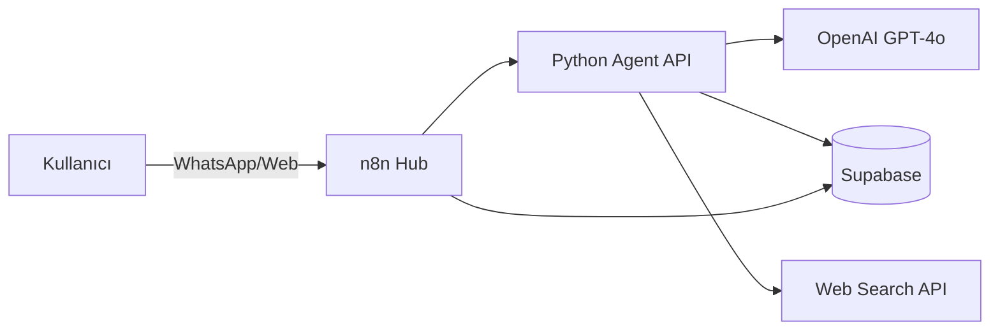
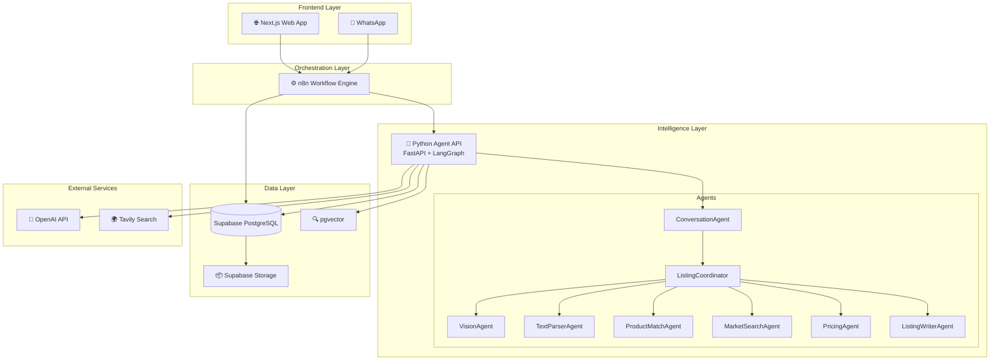
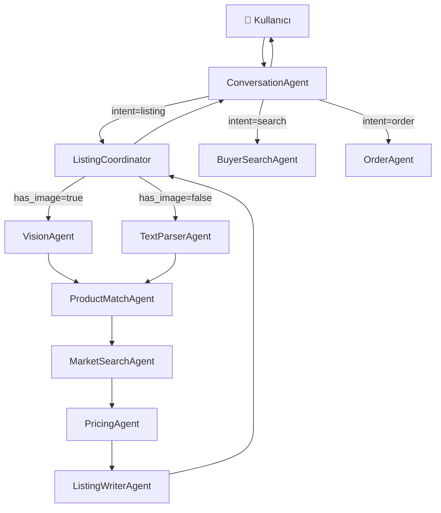
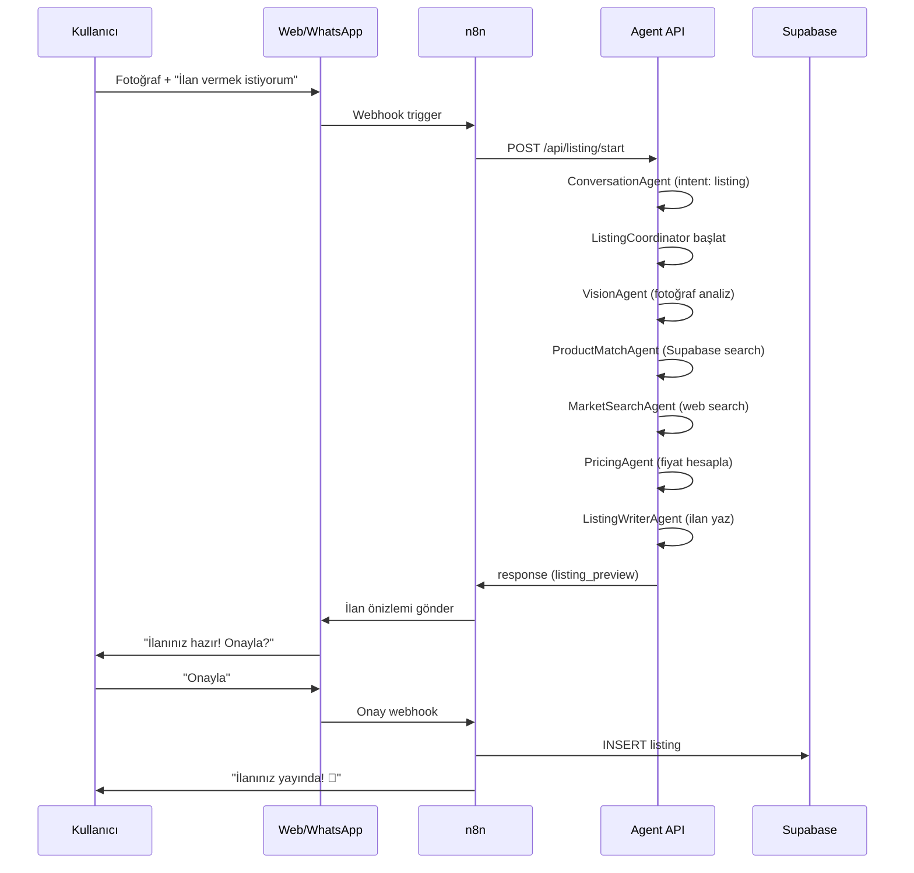
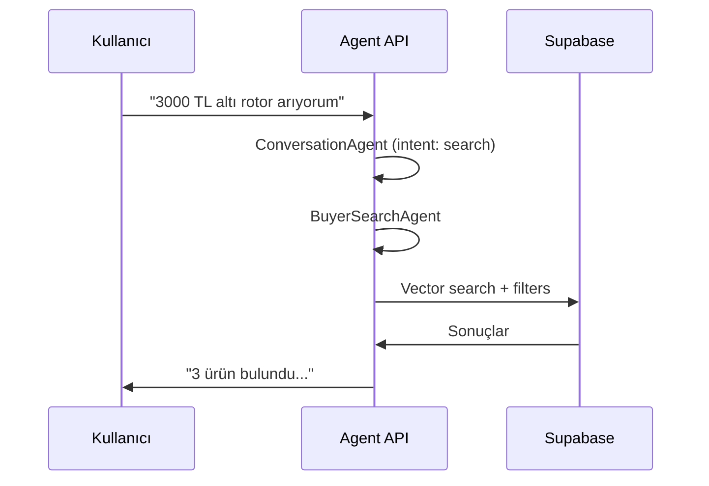

# 🚀 MEGAPAZAR - TAM ENTEGRASYİ MASTER PLANI

**Platform:** Ultra hızlı yapay zeka destekli ilan verme ve ürün araştırma platformu  
**Mimari:** Hibrit (n8n + Python LangGraph + Supabase + Next.js)  
**Versiyon:** 1.0 - Hibrit Plan  
**Tarih:** Kasım 2025

---

## 📑 İÇİNDEKİLER

1. [Platform Özeti](#platform-özeti)
2. [Neden Hibrit Mimari?](#neden-hibrit-mimari)
3. [Tam Sistem Mimarisi](#tam-sistem-mimarisi)
4. [Teknoloji Stack'i](#teknoloji-stacki)
5. [Agent Sistemi](#agent-sistemi)
6. [Supabase Veritabanı Şeması](#supabase-veritabanı-şeması)
7. [Python Agent API - Tam Kod](#python-agent-api-tam-kod)
8. [n8n Workflow Kurulumu](#n8n-workflow-kurulumu)
9. [Frontend (Next.js)](#frontend-nextjs)
10. [İş Akışları - Detaylı](#iş-akışları-detaylı)
11. [Kurulum Adımları](#kurulum-adımları)
12. [Maliyet Analizi](#maliyet-analizi)
13. [Deployment](#deployment)

---

## 🎯 PLATFORM ÖZETİ

### Ne Yapıyor?

Megapazar, kullanıcıların:
- **📸 Fotoğraf yükleyerek** veya **✍️ metin yazarak** saniyeler içinde ilan vermesini
- **🔍 Akıllı arama** ile ürün bulmasını
- **💰 Otomatik fiyat karşılaştırması** yapmasını
- **🤖 WhatsApp üzerinden** veya **Web'den** işlem yapmasını

sağlayan yapay zeka platformudur.

### Nasıl Çalışıyor?



### Temel Özellikler

✅ **Akıllı Fotoğraf Analizi**: GPT-4o Vision ile ürün tanıma  
✅ **Otomatik İlan Yazımı**: Profesyonel ilan metinleri  
✅ **Fiyat Önerisi**: İç+dış piyasa analizi  
✅ **Vector Search**: Benzer ürün bulma  
✅ **WhatsApp Entegrasyonu**: Mesajlaşma üzerinden işlem  
✅ **Komisyon Sistemi**: %2.5 satış komisyonu  

---

## 🤔 NEDEN HİBRİT MİMARİ?

### OpenAI Agent Builder vs Hibrit Karşılaştırması

| Kriter | Agent Builder | Hibrit (n8n+Python) | Fark |
|--------|---------------|---------------------|------|
| **Aylık Maliyet** | ~$250-400 | ~$70-100 | 💰 3-4x ucuz |
| **Geliştirme Süresi** | 1-2 hafta | 3-4 hafta | ⚡ Daha uzun |
| **Özelleştirme** | Sınırlı (UI) | Sınırsız (kod) | 🔧 Tam kontrol |
| **Debug** | Zor (black box) | Kolay (log'lar) | 🐛 Kolay |
| **Ölçeklendirme** | Pahalı | Esnek | 📈 Ekonomik |
| **Vendor Lock-in** | Var | Yok | 🔒 Bağımsız |

### Karar: Hibrit 🎯

**Neden?**
- ✅ Megapazar büyüyecek → Uzun vadeli düşünülmeli
- ✅ Karmaşık özellikler (fotoğraf analiz, komisyon) → Özelleştirme şart
- ✅ Maliyet optimizasyonu kritik → 3x daha ucuz
- ✅ Iterasyon gerekli → Kod kontrolü önemli

---

## 🏗️ TAM SİSTEM MİMARİSİ

### Genel Mimari Diyagramı



### Katman Sorumlulukları

#### 1. **Frontend Layer** (Kullanıcı Arayüzü)
- Next.js web uygulaması
- WhatsApp Business API webhook'ları
- Kullanıcı girişleri ve fotoğraf yükleme

#### 2. **Orchestration Layer** (Yönlendirme)
- n8n workflow'ları
- WhatsApp ↔ API ↔ Supabase bağlantıları
- Mesaj routing ve notification

#### 3. **Intelligence Layer** (Yapay Zeka)
- Python FastAPI uygulaması
- LangGraph agent orkestrasyonu
- 8 farklı uzman agent

#### 4. **Data Layer** (Veri)
- PostgreSQL (Supabase)
- Vector embeddings (pgvector)
- Dosya storage

---

## 💻 TEKNOLOJİ STACK'İ

### Backend

```yaml
Python: 3.11+
Framework: FastAPI
Agent Framework: LangGraph
AI Provider: OpenAI (GPT-4o, GPT-4o-mini, GPT-4o-vision)
Database: Supabase (PostgreSQL + pgvector)
Workflow: n8n
Search: Tavily API
```

### Frontend

```yaml
Framework: Next.js 14 (App Router)
UI: Tailwind CSS
Auth: Supabase Auth
Real-time: Supabase Realtime
```

### DevOps

```yaml
Container: Docker
Deployment: Railway / Render / AWS
Environment: .env
Logs: Python logging + n8n logs
```

---

## 🤖 AGENT SİSTEMİ

### Agent Listesi ve Görevleri

| Agent | LLM Model | Görev | Input | Output |
|-------|-----------|-------|-------|--------|
| **ConversationAgent** | GPT-4o | Kullanıcı ile konuşma, niyet tespiti | user_message | intent + response |
| **ListingCoordinator** | GPT-4o | İlan akışını yönetme | intent + data | orchestration |
| **VisionAgent** | GPT-4o-vision | Fotoğraf analizi | image_url | product_info |
| **TextParserAgent** | GPT-4o | Metin'den ürün çıkarma | raw_text | product_info |
| **ProductMatchAgent** | GPT-4o-mini | Supabase'de benzer ürün arama | product_info | internal_stats |
| **MarketSearchAgent** | GPT-4o | Web'de fiyat araştırması | product_info | external_stats |
| **PricingAgent** | GPT-4o | Fiyat hesaplama | stats + condition | suggested_price |
| **ListingWriterAgent** | GPT-4o | İlan metni yazma | all_data | listing_draft |

### Agent İletişim Grafiği



---

## 🗄️ SUPABASE VERİTABANI ŞEMASI

### Tablolar

#### 1. `users` (Kullanıcılar)

```sql
CREATE TABLE users (
    id UUID PRIMARY KEY DEFAULT gen_random_uuid(),
    phone VARCHAR(20) UNIQUE NOT NULL,
    name VARCHAR(100),
    email VARCHAR(255),
    location TEXT,
    created_at TIMESTAMP DEFAULT NOW(),
    updated_at TIMESTAMP DEFAULT NOW()
);

CREATE INDEX idx_users_phone ON users(phone);
```

#### 2. `listings` (İlanlar)

```sql
CREATE TABLE listings (
    id UUID PRIMARY KEY DEFAULT gen_random_uuid(),
    user_id UUID REFERENCES users(id) ON DELETE CASCADE,
    title TEXT NOT NULL,
    description TEXT,
    category VARCHAR(50),
    price DECIMAL(10,2),
    stock INTEGER DEFAULT 1,
    images TEXT[],
    location TEXT,
    status VARCHAR(20) DEFAULT 'active',
    created_at TIMESTAMP DEFAULT NOW(),
    updated_at TIMESTAMP DEFAULT NOW()
);

CREATE INDEX idx_listings_user_id ON listings(user_id);
CREATE INDEX idx_listings_category ON listings(category);
CREATE INDEX idx_listings_status ON listings(status);
CREATE INDEX idx_listings_created_at ON listings(created_at DESC);
```

#### 3. `product_embeddings` (Vector Search)

```sql
-- pgvector extension ekle
CREATE EXTENSION IF NOT EXISTS vector;

CREATE TABLE product_embeddings (
    id UUID PRIMARY KEY DEFAULT gen_random_uuid(),
    listing_id UUID REFERENCES listings(id) ON DELETE CASCADE,
    embedding vector(1536),
    created_at TIMESTAMP DEFAULT NOW()
);

CREATE INDEX idx_embeddings_listing ON product_embeddings(listing_id);
CREATE INDEX idx_embeddings_vector ON product_embeddings 
    USING ivfflat (embedding vector_cosine_ops)
    WITH (lists = 100);
```

#### 4. `orders` (Siparişler)

```sql
CREATE TABLE orders (
    id UUID PRIMARY KEY DEFAULT gen_random_uuid(),
    listing_id UUID REFERENCES listings(id),
    buyer_id UUID REFERENCES users(id),
    seller_id UUID REFERENCES users(id),
    price DECIMAL(10,2),
    commission DECIMAL(10,2),
    status VARCHAR(20) DEFAULT 'pending',
    created_at TIMESTAMP DEFAULT NOW(),
    completed_at TIMESTAMP
);

CREATE INDEX idx_orders_buyer ON orders(buyer_id);
CREATE INDEX idx_orders_seller ON orders(seller_id);
CREATE INDEX idx_orders_status ON orders(status);
```

#### 5. `conversations` (Konuşma Geçmişi)

```sql
CREATE TABLE conversations (
    id UUID PRIMARY KEY DEFAULT gen_random_uuid(),
    user_id UUID REFERENCES users(id),
    platform VARCHAR(20), -- 'whatsapp' or 'web'
    messages JSONB,
    created_at TIMESTAMP DEFAULT NOW(),
    updated_at TIMESTAMP DEFAULT NOW()
);

CREATE INDEX idx_conversations_user ON conversations(user_id);
```

### Vector Search Fonksiyonu

```sql
CREATE OR REPLACE FUNCTION match_products (
    query_embedding vector(1536),
    match_threshold float,
    match_count int
)
RETURNS TABLE (
    id uuid,
    listing_id uuid,
    similarity float
)
LANGUAGE plpgsql
AS $$
BEGIN
    RETURN QUERY
    SELECT
        product_embeddings.id,
        product_embeddings.listing_id,
        1 - (product_embeddings.embedding <=> query_embedding) as similarity
    FROM product_embeddings
    WHERE 1 - (product_embeddings.embedding <=> query_embedding) > match_threshold
    ORDER BY similarity DESC
    LIMIT match_count;
END;
$$;
```

### Storage Buckets

```sql
-- Supabase Dashboard'dan oluştur
-- Bucket: product-images (public)
-- Bucket: user-documents (private)
```

---

## 🐍 PYTHON AGENT API - TAM KOD

### Proje Yapısı

```
megapazar-agent-api/
├── .env.example
├── .gitignore
├── requirements.txt
├── README.md
├── main.py
├── config.py
├── agents/
│   ├── __init__.py
│   ├── base.py
│   ├── conversation.py
│   ├── listing_coordinator.py
│   ├── vision.py
│   ├── text_parser.py
│   ├── product_match.py
│   ├── market_search.py
│   ├── pricing.py
│   └── listing_writer.py
├── workflows/
│   ├── __init__.py
│   └── listing_flow.py
├── models/
│   ├── __init__.py
│   └── schemas.py
└── utils/
    ├── __init__.py
    ├── supabase_client.py
    ├── openai_client.py
    └── logger.py
```

### 1. `requirements.txt`

```txt
fastapi==0.109.0
uvicorn[standard]==0.27.0
langchain==0.1.0
langchain-openai==0.0.5
langgraph==0.0.20
supabase==2.3.0
python-dotenv==1.0.0
pydantic==2.5.0
pydantic-settings==2.1.0
httpx==0.26.0
pillow==10.2.0
tavily-python==0.3.0
```

### 2. `.env.example`

```env
# OpenAI
OPENAI_API_KEY=sk-proj-...

# Supabase
SUPABASE_URL=https://xxx.supabase.co
SUPABASE_KEY=eyJhbGci...
SUPABASE_SERVICE_KEY=eyJhbGci...

# Tavily Search
TAVILY_API_KEY=tvly-...

# Server
HOST=0.0.0.0
PORT=8000
DEBUG=true

# n8n Webhook (opsiyonel)
N8N_WEBHOOK_URL=https://your-n8n.com/webhook/...
```

### 3. `config.py`

```python
from pydantic_settings import BaseSettings
from functools import lru_cache

class Settings(BaseSettings):
    # OpenAI
    openai_api_key: str
    
    # Supabase
    supabase_url: str
    supabase_key: str
    supabase_service_key: str
    
    # Tavily
    tavily_api_key: str
    
    # Server
    host: str = "0.0.0.0"
    port: int = 8000
    debug: bool = False
    
    class Config:
        env_file = ".env"
        case_sensitive = False

@lru_cache()
def get_settings() -> Settings:
    return Settings()
```

### 4. `utils/logger.py`

```python
import logging
import sys

def setup_logger(name: str) -> logging.Logger:
    logger = logging.getLogger(name)
    logger.setLevel(logging.INFO)
    
    handler = logging.StreamHandler(sys.stdout)
    handler.setLevel(logging.INFO)
    
    formatter = logging.Formatter(
        '%(asctime)s - %(name)s - %(levelname)s - %(message)s'
    )
    handler.setFormatter(formatter)
    
    logger.addHandler(handler)
    return logger
```

### 5. `utils/supabase_client.py`

```python
from supabase import create_client, Client
from config import get_settings
from functools import lru_cache

@lru_cache()
def get_supabase() -> Client:
    settings = get_settings()
    return create_client(settings.supabase_url, settings.supabase_key)

@lru_cache()
def get_supabase_admin() -> Client:
    settings = get_settings()
    return create_client(settings.supabase_url, settings.supabase_service_key)
```

### 6. `utils/openai_client.py`

```python
from langchain_openai import ChatOpenAI
from config import get_settings

def get_llm(model: str = "gpt-4o", temperature: float = 0.7) -> ChatOpenAI:
    settings = get_settings()
    return ChatOpenAI(
        model=model,
        temperature=temperature,
        api_key=settings.openai_api_key
    )

def get_vision_llm() -> ChatOpenAI:
    return get_llm(model="gpt-4o", temperature=0)

def get_mini_llm() -> ChatOpenAI:
    return get_llm(model="gpt-4o-mini", temperature=0)
```

### 7. `models/schemas.py`

```python
from pydantic import BaseModel, Field
from typing import Optional, List, Dict, Any
from datetime import datetime

class ListingRequest(BaseModel):
    user_id: str
    message: str
    image_url: Optional[str] = None
    platform: str = "web"  # 'web' or 'whatsapp'

class ProductInfo(BaseModel):
    product_type: str
    brand: Optional[str] = None
    category: str
    condition: str = "used"  # 'new', 'used', 'damaged'
    quantity: int = 1
    estimated_attributes: Dict[str, Any] = {}

class PricingInfo(BaseModel):
    suggested_price: float
    min_price: float
    max_price: float
    reason: str

class ListingDraft(BaseModel):
    title: str
    description: str
    short_summary: str
    price: float
    category: str
    product_info: ProductInfo

class AgentResponse(BaseModel):
    type: str  # 'ask_question', 'listing_preview', 'listing_complete'
    message: str
    data: Optional[Dict[str, Any]] = None
    next_action: Optional[str] = None

class SearchRequest(BaseModel):
    user_id: str
    query: str
    filters: Optional[Dict[str, Any]] = None

class OrderRequest(BaseModel):
    listing_id: str
    buyer_id: str
    quantity: int = 1
```

### 8. `agents/base.py`

```python
from abc import ABC, abstractmethod
from typing import Dict, Any
from utils.logger import setup_logger

class BaseAgent(ABC):
    def __init__(self, name: str):
        self.name = name
        self.logger = setup_logger(name)
    
    @abstractmethod
    def __call__(self, state: Dict[str, Any]) -> Dict[str, Any]:
        """Agent'ın ana işlev metodu"""
        pass
    
    def log(self, message: str, level: str = "info"):
        if level == "info":
            self.logger.info(f"[{self.name}] {message}")
        elif level == "error":
            self.logger.error(f"[{self.name}] {message}")
        elif level == "warning":
            self.logger.warning(f"[{self.name}] {message}")
```

### 9. `agents/conversation.py`

```python
from agents.base import BaseAgent
from utils.openai_client import get_llm
from langchain.prompts import ChatPromptTemplate
from typing import Dict, Any
import re

class ConversationAgent(BaseAgent):
    def __init__(self):
        super().__init__("ConversationAgent")
        self.llm = get_llm(model="gpt-4o", temperature=0.7)
        self.prompt = ChatPromptTemplate.from_messages([
            ("system", """Sen Megapazar'ın yardımcı asistanısın.

Görevin kullanıcının niyetini anlamak:
- İlan vermek mi istiyor? (anahtar kelimeler: "ilan ver", "satmak istiyorum", "satacağım")
- Ürün mü arıyor? (anahtar kelimeler: "ara", "bul", "arıyorum", "fiyat")
- Satın alma mı yapıyor? (anahtar kelimeler: "satın al", "sipariş", "almak istiyorum")

Kısa, sade, samimi Türkçe konuş.
Kullanıcıya rehberlik et ama çok fazla soru sorma."""),
            ("human", "{input}")
        ])
    
    def __call__(self, state: Dict[str, Any]) -> Dict[str, Any]:
        self.log(f"Processing message: {state.get('message', '')[:50]}...")
        
        # LLM'den cevap al
        response = self.llm.invoke(
            self.prompt.format_messages(input=state["message"])
        )
        
        # Intent tespit et
        intent = self._detect_intent(state["message"], response.content)
        
        state["intent"] = intent
        state["ai_response"] = response.content
        state["conversation_history"] = state.get("conversation_history", [])
        state["conversation_history"].append({
            "role": "assistant",
            "content": response.content
        })
        
        self.log(f"Detected intent: {intent}")
        return state
    
    def _detect_intent(self, user_message: str, ai_response: str) -> str:
        """Kullanıcı niyetini tespit et"""
        msg_lower = user_message.lower()
        
        # İlan verme kelimeleri
        listing_keywords = ["ilan", "sat", "satmak", "satacağım", "ürün ver", "ekle"]
        if any(kw in msg_lower for kw in listing_keywords):
            return "listing"
        
        # Arama kelimeleri
        search_keywords = ["ara", "bul", "arıyorum", "fiyat", "kaç para", "ne kadar"]
        if any(kw in msg_lower for kw in search_keywords):
            return "search"
        
        # Satın alma kelimeleri
        order_keywords = ["satın al", "sipariş", "almak istiyorum", "sepet"]
        if any(kw in msg_lower for kw in order_keywords):
            return "order"
        
        # Default: conversation
        return "conversation"
```

### 10. `agents/vision.py`

```python
from agents.base import BaseAgent
from utils.openai_client import get_vision_llm
from models.schemas import ProductInfo
from typing import Dict, Any
import json

class VisionAgent(BaseAgent):
    def __init__(self):
        super().__init__("VisionAgent")
        self.llm = get_vision_llm()
    
    def __call__(self, state: Dict[str, Any]) -> Dict[str, Any]:
        image_url = state.get("image_url")
        if not image_url:
            self.log("No image URL provided", "error")
            state["product_info"] = None
            return state
        
        self.log(f"Analyzing image: {image_url[:50]}...")
        
        prompt = """Bu fotoğraftaki ürünü detaylı analiz et.

Şunları belirle:
- Ürün tipi nedir? (örn: "Endüstriyel Rotor Gövdesi")
- Marka tahmin edebiliyor musun?
- Kategori nedir? (örn: "Endüstriyel Malzemeler", "Elektronik", "Mobilya")
- Durum: yeni mi, ikinci el mi, hasarlı mı?
- Fiziksel özellikler (materyal, boyut, renk vb.)

JSON formatında döndür:
{
    "product_type": "string",
    "brand": "string | null",
    "category": "string",
    "condition": "new/used/damaged",
    "estimated_attributes": {
        "material": "string | null",
        "size": "string | null",
        "color": "string | null"
    }
}"""
        
        try:
            response = self.llm.invoke([
                {"type": "text", "text": prompt},
                {"type": "image_url", "image_url": {"url": image_url}}
            ])
            
            # JSON parse et
            product_data = json.loads(response.content)
            product_info = ProductInfo(**product_data)
            
            state["product_info"] = product_info.model_dump()
            self.log(f"Product identified: {product_info.product_type}")
            
        except Exception as e:
            self.log(f"Vision analysis failed: {str(e)}", "error")
            state["product_info"] = None
        
        return state
```

### 11. `agents/text_parser.py`

```python
from agents.base import BaseAgent
from utils.openai_client import get_llm
from models.schemas import ProductInfo
from typing import Dict, Any
import json

class TextParserAgent(BaseAgent):
    def __init__(self):
        super().__init__("TextParserAgent")
        self.llm = get_llm(model="gpt-4o", temperature=0)
    
    def __call__(self, state: Dict[str, Any]) -> Dict[str, Any]:
        raw_text = state.get("message", "")
        self.log(f"Parsing text: {raw_text[:50]}...")
        
        prompt = f"""Kullanıcının aşağıdaki metninden ürün bilgisini çıkar:

"{raw_text}"

Şunları belirle:
- Ürün tipi
- Kategori
- Marka (varsa)
- Adet
- Durum (yeni/ikinci el)
- Ekstra notlar

JSON formatında döndür:
{{
    "product_type": "string",
    "brand": "string | null",
    "category": "string",
    "condition": "new/used/damaged",
    "quantity": 1,
    "extra_notes": "string"
}}

Tahmin yapman gerekiyorsa en mantıklı tahmini ver ama asla uydurma."""
        
        try:
            response = self.llm.invoke(prompt)
            product_data = json.loads(response.content)
            product_info = ProductInfo(**product_data)
            
            state["product_info"] = product_info.model_dump()
            self.log(f"Product parsed: {product_info.product_type}")
            
        except Exception as e:
            self.log(f"Text parsing failed: {str(e)}", "error")
            state["product_info"] = None
        
        return state
```

### 12. `agents/product_match.py`

```python
from agents.base import BaseAgent
from utils.supabase_client import get_supabase
from utils.openai_client import get_llm
from typing import Dict, Any
import openai

class ProductMatchAgent(BaseAgent):
    def __init__(self):
        super().__init__("ProductMatchAgent")
        self.supabase = get_supabase()
        self.llm = get_llm(model="gpt-4o-mini")
    
    def __call__(self, state: Dict[str, Any]) -> Dict[str, Any]:
        product_info = state.get("product_info")
        if not product_info:
            state["internal_stats"] = {}
            return state
        
        self.log(f"Searching for similar products: {product_info.get('product_type')}")
        
        try:
            # Embedding oluştur
            query_text = f"{product_info['product_type']} {product_info.get('category', '')}"
            embedding = self._get_embedding(query_text)
            
            # Vector search
            results = self.supabase.rpc(
                'match_products',
                {
                    'query_embedding': embedding,
                    'match_threshold': 0.7,
                    'match_count': 20
                }
            ).execute()
            
            if results.data:
                listing_ids = [r['listing_id'] for r in results.data]
                
                # Fiyat istatistikleri
                listings = self.supabase.table('listings') \
                    .select('price') \
                    .in_('id', listing_ids) \
                    .eq('status', 'active') \
                    .execute()
                
                prices = [float(l['price']) for l in listings.data if l['price']]
                
                if prices:
                    state["internal_stats"] = {
                        "similar_count": len(prices),
                        "avg_price": sum(prices) / len(prices),
                        "min_price": min(prices),
                        "max_price": max(prices)
                    }
                    self.log(f"Found {len(prices)} similar products, avg: {state['internal_stats']['avg_price']:.2f} TL")
                else:
                    state["internal_stats"] = {}
            else:
                state["internal_stats"] = {}
                
        except Exception as e:
            self.log(f"Product match failed: {str(e)}", "error")
            state["internal_stats"] = {}
        
        return state
    
    def _get_embedding(self, text: str) -> list:
        """OpenAI embedding oluştur"""
        from config import get_settings
        settings = get_settings()
        
        client = openai.OpenAI(api_key=settings.openai_api_key)
        response = client.embeddings.create(
            model="text-embedding-3-small",
            input=text
        )
        return response.data[0].embedding
```

### 13. `agents/market_search.py`

```python
from agents.base import BaseAgent
from utils.openai_client import get_llm
from typing import Dict, Any
import json

class MarketSearchAgent(BaseAgent):
    def __init__(self):
        super().__init__("MarketSearchAgent")
        self.llm = get_llm(model="gpt-4o", temperature=0)
    
    def __call__(self, state: Dict[str, Any]) -> Dict[str, Any]:
        product_info = state.get("product_info")
        if not product_info:
            state["external_stats"] = {}
            return state
        
        self.log(f"Searching web for: {product_info.get('product_type')}")
        
        # Tavily API kullanımı (opsiyonel)
        try:
            from config import get_settings
            settings = get_settings()
            
            if settings.tavily_api_key:
                from tavily import TavilyClient
                tavily = TavilyClient(api_key=settings.tavily_api_key)
                
                query = f"{product_info['product_type']} fiyat Türkiye"
                results = tavily.search(query, max_results=5)
                
                # LLM ile fiyat analizi
                prompt = f"""Aşağıdaki web arama sonuçlarından {product_info['product_type']} için fiyat bilgisi çıkar:

{json.dumps(results, ensure_ascii=False)}

JSON döndür:
{{
    "external_avg_price": 3000,
    "external_min_price": 2500,
    "external_max_price": 3800,
    "sources_checked": ["trendyol", "amazon"]
}}"""
                
                response = self.llm.invoke(prompt)
                external_stats = json.loads(response.content)
                state["external_stats"] = external_stats
                
                self.log(f"Web search complete, avg: {external_stats.get('external_avg_price', 0):.2f} TL")
            else:
                # Tavily yoksa dummy data
                state["external_stats"] = {}
                
        except Exception as e:
            self.log(f"Market search failed: {str(e)}", "error")
            state["external_stats"] = {}
        
        return state
```

### 14. `agents/pricing.py`

```python
from agents.base import BaseAgent
from utils.openai_client import get_llm
from models.schemas import PricingInfo
from typing import Dict, Any
import json

class PricingAgent(BaseAgent):
    def __init__(self):
        super().__init__("PricingAgent")
        self.llm = get_llm(model="gpt-4o", temperature=0)
    
    def __call__(self, state: Dict[str, Any]) -> Dict[str, Any]:
        product_info = state.get("product_info", {})
        internal_stats = state.get("internal_stats", {})
        external_stats = state.get("external_stats", {})
        
        self.log("Calculating price recommendation...")
        
        prompt = f"""Aşağıdaki verilere göre fiyat önerisi hesapla:

Ürün Bilgisi:
{json.dumps(product_info, ensure_ascii=False)}

İç Piyasa (Megapazar):
{json.dumps(internal_stats, ensure_ascii=False)}

Dış Piyasa (Web):
{json.dumps(external_stats, ensure_ascii=False)}

Görevin:
1. İç ve dış piyasa verilerini analiz et
2. Ürün durumunu (yeni/ikinci el) göz önüne al
3. Psikolojik fiyatlandırma uygula (2990, 2750 gibi)
4. Mantıklı bir fiyat aralığı belirle

JSON döndür:
{{
    "suggested_price": 2750,
    "min_reasonable_price": 2500,
    "max_reasonable_price": 3200,
    "reason": "İç pazarda ortalama 2800 TL, dış piyasada 3000 TL. Ürün ikinci el olduğu için %10 düşük fiyat öneriyorum."
}}"""
        
        try:
            response = self.llm.invoke(prompt)
            pricing_data = json.loads(response.content)
            pricing_info = PricingInfo(**pricing_data)
            
            state["pricing"] = pricing_info.model_dump()
            self.log(f"Price calculated: {pricing_info.suggested_price:.2f} TL")
            
        except Exception as e:
            self.log(f"Pricing failed: {str(e)}", "error")
            # Fallback fiyat
            state["pricing"] = {
                "suggested_price": 1000,
                "min_price": 800,
                "max_price": 1200,
                "reason": "Fiyat hesaplanamadı, tahmin edildi."
            }
        
        return state
```

### 15. `agents/listing_writer.py`

```python
from agents.base import BaseAgent
from utils.openai_client import get_llm
from models.schemas import ListingDraft
from typing import Dict, Any
import json

class ListingWriterAgent(BaseAgent):
    def __init__(self):
        super().__init__("ListingWriterAgent")
        self.llm = get_llm(model="gpt-4o", temperature=0.8)
    
    def __call__(self, state: Dict[str, Any]) -> Dict[str, Any]:
        product_info = state.get("product_info", {})
        pricing = state.get("pricing", {})
        user_location = state.get("user_location", "Türkiye")
        
        self.log("Writing listing content...")
        
        prompt = f"""Profesyonel bir ilan metni yaz:

Ürün Bilgisi:
{json.dumps(product_info, ensure_ascii=False)}

Fiyat: {pricing.get('suggested_price', 0)} TL
Konum: {user_location}

Görevin:
1. Dikkat çekici ama abartısız başlık yaz
2. 3-4 paragraflık açıklayıcı ilan metni
3. SEO uyumlu, anahtar kelimeler içeren
4. 1 cümlelik kısa özet

JSON döndür:
{{
    "title": "string (max 80 karakter)",
    "description": "string (3-4 paragraf)",
    "short_summary": "string (1 cümle)"
}}

Türkçe, profesyonel ama samimi dil kullan."""
        
        try:
            response = self.llm.invoke(prompt)
            listing_data = json.loads(response.content)
            
            # ListingDraft oluştur
            listing_draft = {
                "title": listing_data["title"],
                "description": listing_data["description"],
                "short_summary": listing_data["short_summary"],
                "price": pricing.get("suggested_price", 0),
                "category": product_info.get("category", "Diğer"),
                "product_info": product_info
            }
            
            state["listing_draft"] = listing_draft
            self.log(f"Listing written: {listing_data['title'][:30]}...")
            
        except Exception as e:
            self.log(f"Listing writing failed: {str(e)}", "error")
            state["listing_draft"] = None
        
        return state
```

### 16. `agents/listing_coordinator.py`

```python
from agents.base import BaseAgent
from agents.vision import VisionAgent
from agents.text_parser import TextParserAgent
from agents.product_match import ProductMatchAgent
from agents.market_search import MarketSearchAgent
from agents.pricing import PricingAgent
from agents.listing_writer import ListingWriterAgent
from typing import Dict, Any

class ListingCoordinator(BaseAgent):
    def __init__(self):
        super().__init__("ListingCoordinator")
        
        # Alt agent'ları başlat
        self.vision_agent = VisionAgent()
        self.text_parser = TextParserAgent()
        self.product_match = ProductMatchAgent()
        self.market_search = MarketSearchAgent()
        self.pricing_agent = PricingAgent()
        self.listing_writer = ListingWriterAgent()
    
    def __call__(self, state: Dict[str, Any]) -> Dict[str, Any]:
        self.log("Starting listing coordination...")
        
        # 1. Ürün bilgisi çıkarma (fotoğraf veya metin)
        if state.get("image_url"):
            self.log("Using vision analysis...")
            state = self.vision_agent(state)
        else:
            self.log("Using text parsing...")
            state = self.text_parser(state)
        
        # Ürün bilgisi yoksa hata
        if not state.get("product_info"):
            state["response_type"] = "ask_question"
            state["ai_response"] = "Ürünü tam olarak anlayamadım. Biraz daha detay verebilir misiniz?"
            return state
        
        # 2. İç piyasa araştırması
        self.log("Searching internal market...")
        state = self.product_match(state)
        
        # 3. Dış piyasa araştırması
        self.log("Searching external market...")
        state = self.market_search(state)
        
        # 4. Fiyat hesaplama
        self.log("Calculating pricing...")
        state = self.pricing_agent(state)
        
        # 5. İlan metni yazma
        self.log("Writing listing...")
        state = self.listing_writer(state)
        
        # 6. Son cevap
        if state.get("listing_draft"):
            state["response_type"] = "listing_preview"
            state["ai_response"] = self._format_preview(state["listing_draft"])
        else:
            state["response_type"] = "error"
            state["ai_response"] = "İlan oluşturulurken bir sorun oluştu."
        
        self.log("Listing coordination complete")
        return state
    
    def _format_preview(self, draft: Dict[str, Any]) -> str:
        """İlan önizleme mesajı"""
        return f"""✅ İlanınız hazır!

📋 **{draft['title']}**

💰 Fiyat: {draft['price']:.2f} TL
📦 Kategori: {draft['category']}

📝 Açıklama:
{draft['description'][:200]}...

İlanı yayınlamak için "Onayla" yazın, değişiklik için "Düzenle" yazın."""
```

### 17. `workflows/listing_flow.py`

```python
from langgraph.graph import StateGraph, END
from typing import TypedDict, Annotated
from agents.conversation import ConversationAgent
from agents.listing_coordinator import ListingCoordinator

class MegapazarState(TypedDict):
    user_id: str
    message: str
    image_url: str | None
    platform: str
    intent: str
    conversation_history: list
    product_info: dict | None
    internal_stats: dict
    external_stats: dict
    pricing: dict | None
    listing_draft: dict | None
    response_type: str
    ai_response: str

def create_listing_workflow():
    """İlan verme workflow'unu oluştur"""
    
    # Agent'ları başlat
    conversation_agent = ConversationAgent()
    listing_coordinator = ListingCoordinator()
    
    # Graph oluştur
    workflow = StateGraph(MegapazarState)
    
    # Node'ları ekle
    workflow.add_node("conversation", conversation_agent)
    workflow.add_node("listing", listing_coordinator)
    
    # Başlangıç
    workflow.set_entry_point("conversation")
    
    # Conditional routing
    def route_by_intent(state: MegapazarState) -> str:
        intent = state.get("intent", "conversation")
        if intent == "listing":
            return "listing"
        else:
            return END
    
    workflow.add_conditional_edges(
        "conversation",
        route_by_intent,
        {
            "listing": "listing",
            END: END
        }
    )
    
    # Listing'den sonra bitir
    workflow.add_edge("listing", END)
    
    return workflow.compile()
```

### 18. `main.py`

```python
from fastapi import FastAPI, HTTPException
from fastapi.middleware.cors import CORSMiddleware
from models.schemas import ListingRequest, AgentResponse, SearchRequest
from workflows.listing_flow import create_listing_workflow
from utils.logger import setup_logger
from config import get_settings
import uvicorn

# Settings
settings = get_settings()
logger = setup_logger("main")

# FastAPI app
app = FastAPI(
    title="Megapazar Agent API",
    description="AI-powered listing and search platform",
    version="1.0.0"
)

# CORS
app.add_middleware(
    CORSMiddleware,
    allow_origins=["*"],
    allow_credentials=True,
    allow_methods=["*"],
    allow_headers=["*"],
)

# Workflow
listing_workflow = create_listing_workflow()

@app.get("/")
async def root():
    return {
        "service": "Megapazar Agent API",
        "version": "1.0.0",
        "status": "running"
    }

@app.get("/health")
async def health_check():
    return {"status": "healthy"}

@app.post("/api/listing/start", response_model=AgentResponse)
async def start_listing(request: ListingRequest):
    """İlan verme akışını başlat"""
    try:
        logger.info(f"New listing request from user: {request.user_id}")
        
        # Initial state
        initial_state = {
            "user_id": request.user_id,
            "message": request.message,
            "image_url": request.image_url,
            "platform": request.platform,
            "intent": None,
            "conversation_history": [],
            "product_info": None,
            "internal_stats": {},
            "external_stats": {},
            "pricing": None,
            "listing_draft": None,
            "response_type": None,
            "ai_response": ""
        }
        
        # Workflow çalıştır
        result = listing_workflow.invoke(initial_state)
        
        # Response oluştur
        response = AgentResponse(
            type=result.get("response_type", "conversation"),
            message=result.get("ai_response", ""),
            data=result.get("listing_draft"),
            next_action="await_user_input"
        )
        
        logger.info(f"Listing flow completed: {response.type}")
        return response
        
    except Exception as e:
        logger.error(f"Listing flow error: {str(e)}")
        raise HTTPException(status_code=500, detail=str(e))

@app.post("/api/listing/confirm")
async def confirm_listing(listing_id: str, user_id: str):
    """İlanı onayla ve Supabase'e kaydet"""
    try:
        from utils.supabase_client import get_supabase
        supabase = get_supabase()
        
        # İlanı kaydet (burada listing_draft state'ten gelecek)
        # Şimdilik placeholder
        
        return {"status": "confirmed", "listing_id": listing_id}
        
    except Exception as e:
        logger.error(f"Listing confirmation error: {str(e)}")
        raise HTTPException(status_code=500, detail=str(e))

@app.post("/api/search")
async def search_products(request: SearchRequest):
    """Ürün arama"""
    try:
        logger.info(f"Search request from user: {request.user_id}")
        
        # BuyerSearchAgent burada çalışacak (şimdilik placeholder)
        
        return {
            "results": [],
            "count": 0
        }
        
    except Exception as e:
        logger.error(f"Search error: {str(e)}")
        raise HTTPException(status_code=500, detail=str(e))

if __name__ == "__main__":
    uvicorn.run(
        "main:app",
        host=settings.host,
        port=settings.port,
        reload=settings.debug
    )
```

### 19. `README.md`

```markdown
# Megapazar Agent API

AI-powered listing and search platform backend.

## Kurulum

1. **Virtual environment oluştur:**
```bash
python -m venv venv
source venv/bin/activate  # Windows: venv\Scripts\activate
```

2. **Bağımlılıkları yükle:**
```bash
pip install -r requirements.txt
```

3. **.env dosyası oluştur:**
```bash
cp .env.example .env
# .env dosyasını düzenle, API key'leri ekle
```

4. **Çalıştır:**
```bash
python main.py
```

API: `http://localhost:8000`  
Docs: `http://localhost:8000/docs`

## Test

```bash
curl -X POST http://localhost:8000/api/listing/start \
  -H "Content-Type: application/json" \
  -d '{
    "user_id": "test-123",
    "message": "4 adet endüstriyel rotor gövdesi satmak istiyorum",
    "platform": "web"
  }'
```
```

---

## ⚙️ N8N WORKFLOW KURULUMU

### n8n Kurulumu

```bash
# Docker ile
docker run -it --rm \
  --name n8n \
  -p 5678:5678 \
  -v ~/.n8n:/home/node/.n8n \
  n8nio/n8n
```

### WhatsApp İlan Verme Workflow

```
1. WhatsApp Trigger (Webhook)
   ↓
2. HTTP Request → Python Agent API
   POST /api/listing/start
   ↓
3. Switch (Response Type)
   ├─ ask_question → WhatsApp Reply
   ├─ listing_preview → WhatsApp Show Preview
   └─ listing_complete → Supabase Insert
```

### Workflow JSON (İmport Edilebilir)

`n8n-workflows/listing-flow.json` dosyası oluşturulacak.

---

## 🌐 FRONTEND (NEXT.JS)

### Kurulum

```bash
npx create-next-app@latest megapazar-web --typescript --tailwind --app
cd megapazar-web
npm install @supabase/supabase-js @supabase/auth-helpers-nextjs
```

### Sayfa Yapısı

```
app/
├── page.tsx              # Ana sayfa (İlan Ver / Ürün Ara)
├── listing/
│   ├── new/
│   │   └── page.tsx      # İlan verme (Chat UI)
│   └── [id]/
│       └── page.tsx      # İlan detay
├── search/
│   └── page.tsx          # Ürün arama
└── profile/
    └── page.tsx          # Kullanıcı profili
```

---

## 🔄 İŞ AKIŞLARI - DETAYLI

### 1. İlan Verme Akışı (Fotoğraflı)



### 2. İlan Verme Akışı (Metin)

Aynı akış, sadece VisionAgent yerine TextParserAgent çalışır.

### 3. Ürün Arama Akışı



---

## 🚀 KURULUM ADIMLARI

### Adım 1: Supabase Kurulumu

1. [supabase.com](https://supabase.com) → Yeni proje oluştur
2. SQL Editor'da yukarıdaki SQL'leri çalıştır
3. Storage → `product-images` bucket oluştur (public)
4. API Keys kopyala

### Adım 2: Python Agent API

```bash
cd megapazar-agent-api
python -m venv venv
source venv/bin/activate
pip install -r requirements.txt
cp .env.example .env
# .env'i düzenle
python main.py
```

### Adım 3: n8n Kurulumu

```bash
docker run -d --name n8n \
  -p 5678:5678 \
  -v ~/.n8n:/home/node/.n8n \
  n8nio/n8n
```

n8n Dashboard → Import workflow → `n8n-workflows/listing-flow.json`

### Adım 4: Frontend

```bash
cd megapazar-web
npm install
npm run dev
```

### Adım 5: WhatsApp Business API

1. Meta Business hesabı oluştur
2. WhatsApp Business API erişimi al
3. Webhook URL'i n8n'e yönlendir

---

## 💰 MALİYET ANALİZİ

### Aylık Maliyet Tahmini (1000 ilan/ay)

| Hizmet | Kullanım | Maliyet |
|--------|----------|---------|
| OpenAI GPT-4o | ~1000 ilan | $50 |
| OpenAI GPT-4o-mini | ~3000 işlem | $15 |
| OpenAI Embeddings | ~2000 ürün | $0.20 |
| Supabase | Free tier | $0 |
| n8n | Self-hosted | $0 |
| Tavily Search | 1000 arama/ay | $0 (free) |
| WhatsApp | 1000 mesaj/ay | $10 |
| **TOPLAM** | | **~$75/ay** |

### Gelir Projeksiyonu

- İlan başına: 10 TL
- Satış komisyonu: %2.5
- 1000 ilan/ay = 10,000 TL
- 100 satış/ay (ort 1000 TL) = 2,500 TL komisyon
- **Toplam Gelir:** 12,500 TL/ay
- **Net Kâr:** ~12,000 TL/ay ($400/ay maliyet ile)

---

## 📦 DEPLOYMENT

### Python API (Railway)

```bash
# railway.app → New Project → Deploy from GitHub
# Environment Variables ekle (.env)
```

### n8n (n8n.cloud veya self-host)

```bash
# Docker Compose ile production
docker-compose up -d
```

### Frontend (Vercel)

```bash
# vercel.com → Import GitHub repo
# Auto-deploy aktif
```

---

## 🎯 SONRAKİ ADIMLAR

### Faz 1: MVP (3-4 hafta)
- ✅ Supabase setup
- ✅ Python Agent API (ConversationAgent, VisionAgent, ListingWriterAgent)
- ✅ n8n workflow (WhatsApp bağlantısı)
- ✅ Minimal web frontend

### Faz 2: İyileştirmeler (2-3 hafta)
- ✅ ProductMatchAgent (vector search)
- ✅ MarketSearchAgent (web scraping)
- ✅ PricingAgent optimizasyonu
- ✅ BuyerSearchAgent

### Faz 3: Ölçeklendirme (devam eden)
- ✅ Sipariş sistemi
- ✅ Komisyon otomasyonu
- ✅ Analytics dashboard
- ✅ Mobil uygulama

---

## 📞 DESTEK VE KAYNAKLAR

- **OpenAI API Docs:** https://platform.openai.com/docs
- **LangGraph Guide:** https://langchain-ai.github.io/langgraph/
- **Supabase Docs:** https://supabase.com/docs
- **n8n Docs:** https://docs.n8n.io

---

## 📄 LİSANS

MIT License - Megapazar 2025

---

**🚀 Hemen başlamak için:**

```bash
git clone <repo>
cd megapazar-agent-api
python -m venv venv
source venv/bin/activate
pip install -r requirements.txt
cp .env.example .env
# .env'i düzenle
python main.py
```

**✅ Hazır!**
